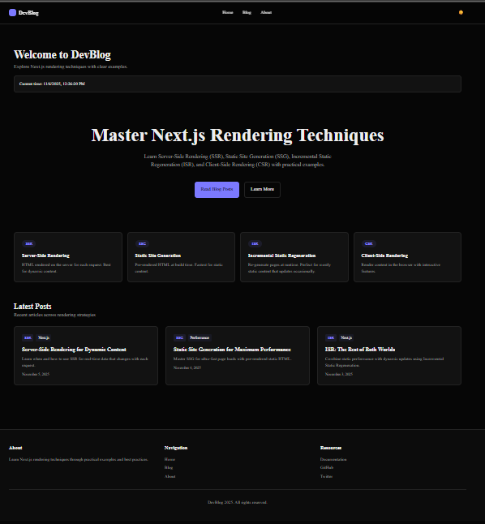
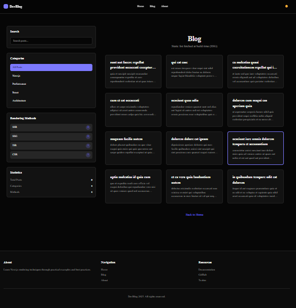
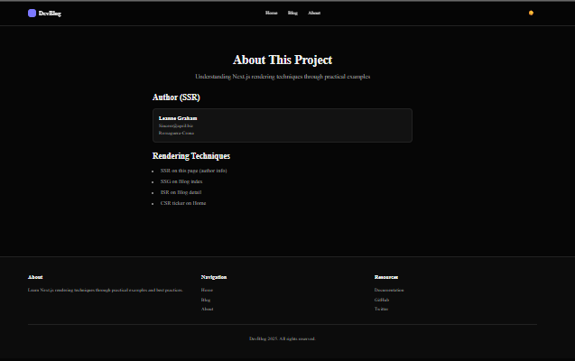

# DevBlog - Next.js Rendering Techniques

A comprehensive demonstration of different rendering strategies in Next.js 16 App Router.

## Features

- **Multiple Rendering Techniques**: SSR, SSG, ISR, and CSR examples
- **Dark Mode Toggle**: Persistent dark/light mode with localStorage
- **Search & Filter**: Search blog posts and filter by category
- **Responsive Design**: Mobile-first design that works on all devices
- **Modern UI**: Built with Tailwind CSS and shadcn/ui components
- **Server Components**: Leverages React Server Components by default
- **Dynamic Routes**: Blog post routing with static generation

## Rendering Techniques Demonstrated

### Server-Side Rendering (SSR)
Pages rendered on the server for each request. Best for dynamic content.

### Static Site Generation (SSG)
Pages pre-rendered at build time. Fastest performance for static content.

### Incremental Static Regeneration (ISR)
Combines SSG and dynamic updates. Pages regenerate in the background.

### Client-Side Rendering (CSR)
Content rendered in the browser. Perfect for interactive features.

## Project Structure

\`\`\`
├── app/
│   ├── blog/
│   │   ├── [slug]/page.tsx      # Dynamic blog post pages
│   │   └── page.tsx              # Blog listing with search
│   ├── about/page.tsx            # About page
│   ├── page.tsx                  # Home page
│   ├── layout.tsx                # Root layout
│   └── globals.css               # Global styles
├── components/
│   ├── blog/
│   │   ├── blog-card.tsx         # Blog post card component
│   │   ├── blog-post-content.tsx # Blog post content display
│   │   └── blog-sidebar.tsx      # Blog sidebar with filters
│   ├── home/
│   │   ├── features-grid.tsx     # Features showcase
│   │   ├── hero-section.tsx      # Hero section
│   │   └── latest-posts.tsx      # Latest posts on home
│   ├── header.tsx                # Header with navigation
│   ├── footer.tsx                # Footer
│   └── theme-provider.tsx        # Dark mode context
├── hooks/
│   └── use-theme.tsx             # Theme hook
├── lib/
│   └── blog-data.ts              # Blog post data
└── package.json
\`\`\`

## Getting Started

### Installation

1. **Clone the repository**
   \`\`\`bash
   git clone <repository-url>
   cd devblog
   \`\`\`

2. **Install dependencies**
   \`\`\`bash
   npm install
   \`\`\`

3. **Run the development server**
   \`\`\`bash
   npm run dev
   \`\`\`

4. **Open your browser**
   Navigate to [http://localhost:3000](http://localhost:3000)

### Building for Production

\`\`\`bash
npm run build
npm start
\`\`\`

## Technologies Used

- **Next.js 16**: React framework with App Router
- **React 19**: UI library with Server Components
- **TypeScript**: Type safety
- **Tailwind CSS v4**: Utility-first CSS framework
- **shadcn/ui**: High-quality UI components
- **Lucide React**: Beautiful SVG icons

## Key Features Implemented

### 1. Dark Mode Toggle
- Persistent storage with localStorage
- System preference detection
- Smooth transitions between themes
- Implemented with Context API

### 2. Search Functionality
- Real-time search across blog posts
- Filters by title and excerpt
- Combined with category filtering

### 3. Category Filtering
- Sidebar with category selection
- Rendering method counts
- Blog statistics

### 4. Responsive Design
- Mobile-first approach
- Breakpoints: sm, md, lg
- Hamburger menu on mobile
- Touch-friendly interface

## Rendering Methods in Action

### Blog Listing Page
- **Method**: Client-Side Rendering (CSR)
- **Why**: Interactive search and filtering
- **File**: `app/blog/page.tsx`

### Individual Blog Posts
- **Method**: Static Site Generation (SSG)
- **Why**: Content doesn't change, pre-rendered at build time
- **File**: `app/blog files

### Home Page
- **Method**: Server-Side Rendering (SSR)
- **Why**: Dynamic latest posts, changes with new content
- **File**: `app/page.tsx`

### About Page
- **Method**: Static Site Generation (SSG)
- **Why**: Static content that rarely changes
- **File**: `app/about/page.tsx`

## SCREENSHOT
![homepage]
![blog]
![About]
## Deployment

LIVE DEMO: https://next-project-phi-six.vercel.app/

## Github repository clone:

https://github.com/Boldecca/next-project.git

## Learning Resources

- [Next.js Documentation](https://nextjs.org/docs)
- [React Server Components](https://react.dev/reference/react/use-client)
- [Tailwind CSS](https://tailwindcss.com)
- [shadcn/ui](https://ui.shadcn.com)

## Author

MUTETERI Rebecca

